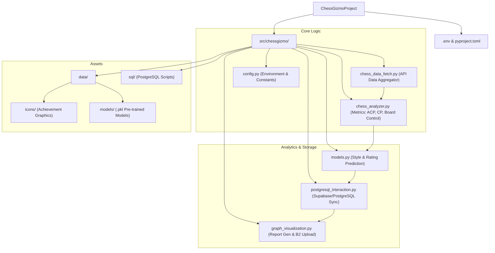
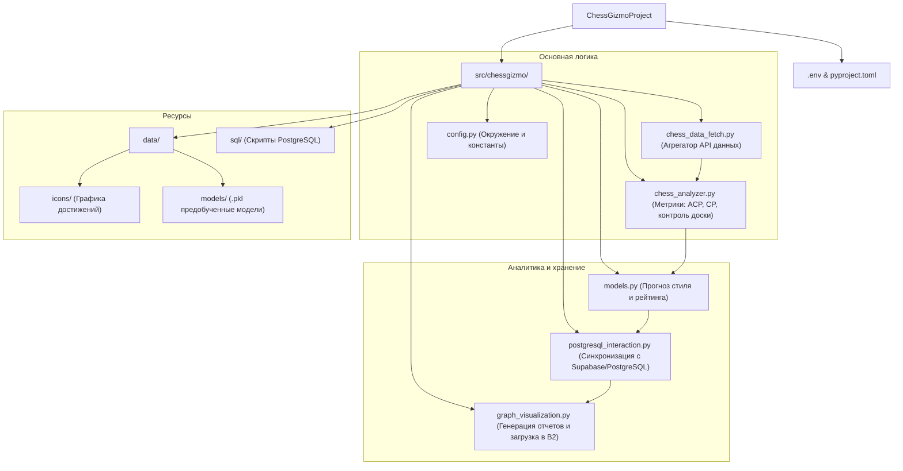

# ChessGizmoProject
<p align="center">
  <a href="#chessgizmo-en">English</a> | 
  <a href="#chessgizmo-ru">Русский</a>
</p>

<span id="chessgizmo-en"></span>

ChessGizmoProject is a comprehensive Python library designed for advanced chess data analysis, visualization, and machine learning-based rating prediction. It fetches game data from major chess platforms, calculates deep metrics, stores statistics in PostgreSQL (Supabase), and generates visual reports uploaded to Backblaze B2.
### 🚀 Key Features
- **Data Aggregation**: Fetch game history seamlessly from Lichess (via API) and Chess.com.

- **Advanced Metrics**: Calculate complex metrics like ACP (Average Centipawn Loss), STDP, king control zones, board masking, etc.

- **Machine Learning**: Predict player styles and expected ratings (Rapid/Blitz) using pre-trained CatBoost and Scikit-learn models.

- **Visualization**: Generate insightful graphical reports and achievement icons, automatically uploading them to Backblaze B2 cloud storage.

- **Database Integration**: Sync processed game data and statistics with Supabase (PostgreSQL).

## 📂 Project Structure


```Plaintext
ChessGizmo_Project/
├── pyproject.toml           # Project metadata and dependencies
├── .env                     # Secrets configuration
├── src/
│   └── chessgizmo/
│       ├── chess_analyzer.py        # Core logic for metric calculations (ACP, CP analysis, board control)
│       ├── chess_data_fetch.py      # Fetches data from APIs and aggregates metrics via analyzer
│       ├── models.py                # ML models for predicting playstyle and rating
│       ├── graph_visualization.py   # Generates visual reports & uploads to B2 Storage
│       ├── posgresql_interaction.py # Handles writing DataFrames to Supabase DB
│       ├── config.py                # Central configuration using environment variables
│       ├── dtypes.py                # Data types definition
│       ├── data/                    # Static assets
│       │   ├── icons/               # Achievement icons for reports
│       │   └── models/              # Pre-trained .pkl models (Rapid/Blitz)
│       └── sql/                     # SQL scripts for database analytics
```

## Data Visualization
The `graph_visualization` module is responsible for converting raw chess data into visual analytical reports. The main types of graphs generated and their purposes are presented below:
- **Opening Tree**: A sunburst chart displaying the opening repertoire for White or Black. The center is the first move, and the following circles represent the branching of variations. Helps analyze the diversity of openings and find the most effective lines.


- **Heatmap**: Visualizes the density of piece movements on the chessboard. Allows you to instantly identify dominant zones of control and the most frequently used squares (for example, concentration in the center on the squares $d4, d5, e4, e5$). Color intensity corresponds to the number of square visits.


- **Marked Raincloud** (Activity Distribution): Compares the activity of your pieces (rooks, queens, knights, and bishops) with the distribution of similar values ​​for players with a certain rating. The vertical "You" line clearly shows whether you play more actively or passively than average in the middlegame and endgame.


- **Versus Violin** (Comparative Analysis): Violin plots, which show the probability density of various game factors (piece activity, attack/defense balance) compared between game stages (Opening vs. Middlegame/Endgame). These plots allow you to identify how your style changes as you move into the deeper stages of a game.


- **Achievements Report**: A summary card displaying the player's average rating predicted by the ML model for different game outcomes (Win/Draw/Lose), as well as a system of achievement badges. Badges are automatically awarded based on playing style, such as activity in the opening ("Strong Development") or a tendency to castling to a specific flank.


## 🛠️ Installation
### Prerequisites
- Python 3.9+

- PostgreSQL database (Supabase recommended)

- Backblaze B2 Bucket

- Lichess Account (for API token)

### Setup
1. **Clone the repository**:
```bash
git clone https://github.com/tehnik-tehnolog/ChessGizmoProject.git
```
2. **Install the package**: Since the project uses `pyproject.toml`, you can install it in editable mode:
```bash
pip install -e .
```
This will automatically install dependencies like `chess`, `pandas`, `catboost`, `sqlalchemy`, `stockfish`, etc.

3. **Stockfish Setup**: Ensure the Stockfish engine is installed on your system and accessible via path for analysis features.

## ⚙️ Configuration
Create a `.env` file in the root directory. This file is required for database connections, cloud storage, and API authentication.

```env
# .env file example

# Supabase / PostgreSQL Connection
HOST=your_supabase_host
PORT=your_supabase_port
USER=your_db_user
PASSWORD=your_db_password

# Backblaze B2 Storage
B2_ENDPOINT=https://s3.your_region.backblazeb2.com
B2_KEY_ID=your_key_id
B2_APPLICATION_KEY=your_application_key
B2_REGION=your_region

# Chess Platforms
LICHESS_TOKEN=your_lichess_api_token
```

### 🔄 Data Pipeline Workflow
The library follows a strict data processing pipeline:

1. **Ingestion** (`chess_data_fetch`):
- Connects to Lichess (using LichessData class with token) or Chess.com.
- Downloads PGNs and game metadata.

2. **Analysis** (`chess_analyzer`):
- Processes raw moves.
- Calculates ACP, STDCPL and other games metrics.

3. **Prediction** (`models`):
- Uses calculated metrics to feed CatBoost models.
- Outputs predicted Rating and Playstyle classification.

4. **Storage** (`posgresql_interaction`):
- Saves the enriched DataFrames to the Supabase PostgreSQL database.

6. **Visualization** (`graph_visualization`):
- Generates PNG reports based on the analysis.
- `ChessStorage` class uploads these assets to the configured Backblaze B2 bucket.

## 📦 Dependencies
Major libraries used in this project:

- **Analysis**: `chess`, `stockfish`, `pandas`, `numpy`, `scikit-learn`, `catboost`

- **APIs & Web**: `berserk` (Lichess), `aioboto3` (S3/B2), `mureq`

- **Database**: `sqlalchemy`, `psycopg2-binary`

- **Visualization**: `matplotlib`, `seaborn`, `plotnine`, `cairosvg`

## 📝 Usage Example
It's better to look at [ChessGizmoTelegramBot](https://github.com/tehnik-tehnolog/ChessGizmoTelegramBot) code for an example. It uses all the library's features.
```Python
import pandas as pd
from stockfish import Stockfish
from chessgizmo.chess_data_fetch import ChesscomData
from chessgizmo.postgresql_interaction import PopulateDB
from chessgizmo.models import ChessModel
from chessgizmo.graph_visualization import ChessStorage, HeatBoard, MarkedRaincloud

#1. Initialize Stockfish (specify the path to the executable file)
sf = Stockfish(path="your_path_to_stockfish_in_windows/stockfish/stockfish-windows-x86-64-avx2.exe")
sf = Stockfish(path="your_path_to_stockfish_in_linux/stockfish/stockfish-windows-x86-64-avx2")
nickname = "hikaru"

#2. Receiving data (Blitz + Rapid)
blitz = ChesscomData(username=nickname, num_games=5, game_type='blitz', stockfish=sf)
rapid = ChesscomData(username=nickname, num_games=5, game_type='rapid', stockfish=sf)

games_info = pd.concat([blitz.chesscom_df, rapid.chesscom_df])
moves_df = pd.concat([blitz.moves_df, rapid.moves_df])

# 3. Working with a Database (Supabase/PostgreSQL)
db = PopulateDB(f"chess_rapid_{nickname.lower()}")
db.create_database()
db.save_df( 
df_users=pd.DataFrame({'username': [nickname], 'num_games': [10]}), 
games_info=games_info, 
games_by_moves=moves_df
)

# Run SQL scripts for Aggregate calculations (located in chessgizmo/sql/)
for script in ['update_replace_neg1_with_null.sql', 'add_new_columns.sql', 'av_value_gen.sql']:
db.run_sql_script(script)

# 4. Analysis and ML forecasts
model = ChessModel(chess_games_info=games_info, game_type='rapid')

# rating_dict: {1.0: predicted_rating_if_win, 0.5: if_draw, 0.0: if_loss}
rating_predictions = model.get_rating_dict()
# style_dict: { 'GM_Name': similarity_percentage, ... }
style_match = model.get_game_style()

print(f"Predicted rating if win: {rating_predictions[1.0]}")
print(f"Greatest style similarity: {max(style_match, key=style_match.get)}")

# 5. Visualization and export to Cloud (Backblaze B2)
storage = ChessStorage() # Takes configs from .env

# Generating a heatmap (HeatBoard)
# Combining the move indices of White and Black into one array
squares = moves_df[['white_move_index', 'black_move_index']].stack().astype(int)
HeatBoard(username=nickname, squares=squares, description='all', storage=storage)
```

## 📄 License
👤 Author

tehnik-tehnolog 📧 pavelkos91011@gmail.com

[MIT](https://choosealicense.com/licenses/mit/)

---

<span id="chessgizmo-ru"></span>

ChessGizmoProject — это комплексная библиотека Python, предназначенная для продвинутого анализа шахматных данных, визуализации и прогнозирования рейтинга на основе машинного обучения. Она извлекает данные игр с основных шахматных платформ, рассчитывает глубокие метрики, сохраняет статистику в PostgreSQL (Supabase) и генерирует визуальные отчеты, загружаемые в Backblaze B2.

### 🚀 Ключевые особенности
- **Агрегация данных**: Бесшовное получение истории игр с Lichess (через API) и Chess.com.

- **Продвинутые метрики**: Расчет сложных показателей, таких как ACP (средняя потеря центипешек), STDP, зоны контроля короля, маскировка доски и т. д.

- **Машинное обучение**: Прогнозирование стиля игрока и ожидаемого рейтинга (Rapid/Blitz) с использованием предварительно обученных моделей CatBoost и Scikit-learn.

- **Визуализация**: Создание информативных графических отчетов и иконок достижений с автоматической загрузкой в облачное хранилище Backblaze B2.

- **Интеграция с базами данных**: Синхронизация обработанных данных игр и статистики с Supabase (PostgreSQL).


## 📂 Структура проекта


```Plaintext
ChessGizmoProject/
├── pyproject.toml           # Метаданные проекта и зависимости
├── .env                     # Конфигурация секретов
├── src/
│   └── chessgizmo/
│       ├── chess_analyzer.py        # Основная логика расчета метрик (ACP, CP, анализ контроля)
│       ├── chess_data_fetch.py      # Сбор данных из API и агрегация метрик через анализатор
│       ├── models.py                # ML-модели для предсказания стиля игры и рейтинга
│       ├── graph_visualization.py   # Генерация визуальных отчетов и загрузка в хранилище B2
│       ├── posgresql_interaction.py # Обработка записи DataFrames в БД Supabase
│       ├── config.py                # Центральная конфигурация (переменные окружения)
│       ├── dtypes.py                # Определение типов данных
│       ├── data/                    # Статические ресурсы
│       │   ├── icons/               # Иконки достижений для отчетов
│       │   └── models/              # Предобученные .pkl модели (Rapid/Blitz)
│       └── sql/                     # SQL-скрипты для аналитики базы данных
```


## Визуализация данных
Модуль `graph_visualization` отвечает за преобразование сырых шахматных данных в наглядные аналитические отчеты. Ниже представлены основные типы генерируемых графиков и их назначение:
- **Opening Tree** (Дерево дебютов): Радиальная диаграмма (Sunburst chart), отображающая репертуар дебютов за белых или черных. Центр — первый ход, последующие круги — ветвление вариантов. Помогает проанализировать разнообразие дебютов и найти наиболее эффективные линии.


- **Heatmap** (Тепловая карта ходов): Визуализирует плотность перемещения фигур по шахматной доске. Позволяет мгновенно определить доминирующие зоны контроля и наиболее часто используемые поля (например, концентрация в центре на полях $d4, d5, e4, e5$). Интенсивность цвета соответствует количеству посещений поля.


- **Marked Raincloud** (Распределение активности): Сравнивает показатели активности ваших фигур (ладей, ферзей, коней и слонов) с распределением аналогичных показателей у игроков с определенным рейтингом. Вертикальная линия «You» наглядно показывает, играете ли вы активнее или пассивнее среднего уровня в миттельшпиле и эндшпиле.


- **Versus Violin** (Сравнительный анализ): Скрипичные диаграммы (Violin plots), которые показывают плотность вероятности различных игровых коэффициентов (активность фигур, баланс атаки и защиты) в сравнении между стадиями игры (Opening vs Middlegame/Endgame). Позволяют выявить, как меняется ваш стиль при переходе в глубокую стадию партии.


- **Achievements Report** (Отчет о достижениях): Сводная карточка, отображающая средний предсказанный ML-моделью рейтинг игрока для разных исходов партии (Win/Draw/Lose), а также систему значков-ачивок. Значки автоматически присваиваются на основе стиля игры, например, за активность в дебюте («Сильное развитие») или склонность к рокировке на конкретный фланг.


## 🛠️ Установка

### Предварительные требования
- Python 3.9+
- База данных PostgreSQL (рекомендуется Supabase)
- Бакет Backblaze B2
- Аккаунт Lichess (для получения API-токена)

### Настройка
1. **Клонируйте репозиторий**:
```bash
git clone https://github.com/tehnik-tehnolog/ChessGizmoProject.git
```

2. **Установите пакет**:
```bash
pip install -e .
```

3. **Настройка Stockfish**: Убедитесь, что движок установлен и путь к нему доступен.

## ⚙️ Конфигурация
Создайте файл `.env` в корневой директории:

```env
# .env file example

# Supabase / PostgreSQL Connection
HOST=your_supabase_host
PORT=your_supabase_port
USER=your_db_user
PASSWORD=your_db_password

# Backblaze B2 Storage
B2_ENDPOINT=https://s3.your_region.backblazeb2.com
B2_KEY_ID=your_key_id
B2_APPLICATION_KEY=your_application_key
B2_REGION=your_region

# Chess Platforms
LICHESS_TOKEN=your_lichess_api_token
```

Библиотека использует строгий алгоритм обработки данных:

1. **Загрузка** (`chess_data_fetch`):
- Подключается к Lichess (используя класс LichessData с токеном) или Chess.com.
- Загружает PGN-файлы и метаданные партий.

2. **Анализ** (`chess_analyzer`):
- Обрабатывает исходные ходы.
- Вычисляет ACP, STDCPL и другие метрики партий.

3. **Прогнозирование** (`models`):
- Использует вычисленные метрики для передачи в модели CatBoost.
- Выводит прогнозируемый рейтинг и классификацию стиля игры.

4. **Хранение** (`posgresql_interaction`):
- Сохраняет обогащенные DataFrames в базу данных Supabase - PostgreSQL.

5. **Визуализация** (`graph_visualization`):

- Генерирует отчеты в формате PNG на основе анализа.
- Класс `ChessStorage` загружает эти ресурсы в настроенный сегмент Backblaze B2.

## 📦 Зависимости
Основные библиотеки, использованные в этом проекте:

- **Анализ**: `chess`, `stockfish`, `pandas`, `numpy`, `scikit-learn`, `catboost`

- **API и веб-интерфейсы**: `berserk` (Lichess), `aioboto3` (S3/B2), `mureq`

- **База данных**: `sqlalchemy`, `psycopg2-binary`

- **Визуализация**: `matplotlib`, `seaborn`, `plotnine`, `cairosvg`

## 📝 Пример использования
В качестве примера лучше посмотреть код [ChessGizmoTelegramBot](https://github.com/tehnik-tehnolog/ChessGizmoTelegramBot). Он использует все возможности библиотеки.
```Python
import pandas as pd
from stockfish import Stockfish
from chessgizmo.chess_data_fetch import ChesscomData
from chessgizmo.postgresql_interaction import PopulateDB
from chessgizmo.models import ChessModel
from chessgizmo.graph_visualization import ChessStorage, HeatBoard, MarkedRaincloud

#1. Инициализация Stockfish (укажите путь к исполняемому файлу)
sf = Stockfish(path="your_path_to_stockfish_in_windows/stockfish/stockfish-windows-x86-64-avx2.exe")
sf = Stockfish(path="your_path_to_stockfish_in_linux/stockfish/stockfish-windows-x86-64-avx2")
nickname = "hikaru"

#2. Получение данных (Блиц + Рапид)
blitz = ChesscomData(username=nickname, num_games=5, game_type='blitz', stockfish=sf)
rapid = ChesscomData(username=nickname, num_games=5, game_type='rapid', stockfish=sf)

games_info = pd.concat([blitz.chesscom_df, rapid.chesscom_df])
moves_df = pd.concat([blitz.moves_df, rapid.moves_df])

# 3. Работа с базой данных (Supabase/PostgreSQL)
db = PopulateDB(f"chess_rapid_{nickname.lower()}")
db.create_database()
db.save_df(
df_users=pd.DataFrame({'username': [nickname], 'num_games': [10]}),
games_info=games_info,
games_by_moves=moves_df
)

# Запуск SQL-скриптов для агрегированных вычислений (расположены в chessgizmo/sql/)
for script in ['update_replace_neg1_with_null.sql', 'add_new_columns.sql', 'av_value_gen.sql']:
db.run_sql_script(script)

# 4. Анализ и прогнозы машинного обучения
model = ChessModel(chess_games_info=games_info, game_type='rapid')

# rating_dict: {1.0: predicted_rating_if_win, 0.5: if_draw, 0.0: if_loss}
rating_predictions = model.get_rating_dict()
# style_dict: { 'GM_Name': similarity_percentage, ... }
style_match = model.get_game_style()

print(f"Прогнозируемый рейтинг в случае победы: {rating_predictions[1.0]}")
print(f"Наибольшее сходство стилей: {max(style_match, key=style_match.get)}")

# 5. Визуализация и экспорт в облако (Backblaze B2)
storage = ChessStorage() # Берет конфигурации из .env

# Создание тепловой карты (HeatBoard)
# Объединение индексов ходов белых и черных в один массив
squares = moves_df[['white_move_index', 'black_move_index']].stack().astype(int)
HeatBoard(username=nickname, squares=squares, description='all', storage=storage)
```

## 📄 Лицензия

👤 Автор

tehnik-tehnolog  📧 pavelkos91011@gmail.com

[MIT](https://choosealicense.com/licenses/mit/)
